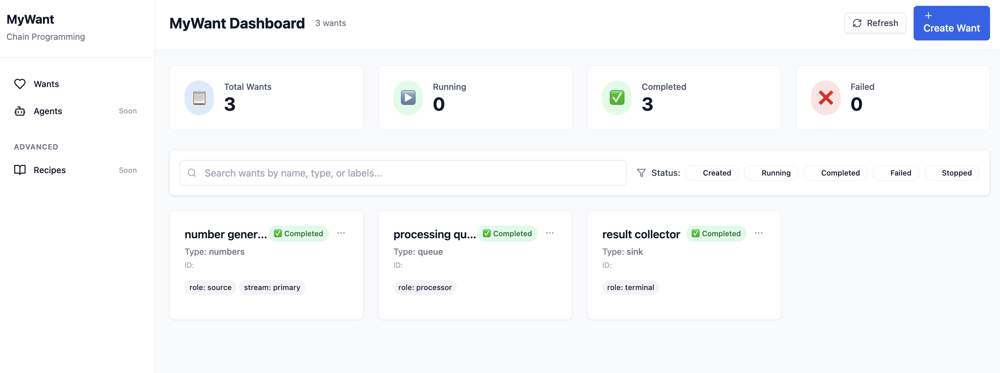

# MyWant



**Declarative chain programming with YAML configuration.** Express what you want to achieve, not how to do it.

📚 **Documentation:** [Want System](docs/want-system.md) | [Agent System](docs/agent-system.md) | [Agent Catalog](AGENTS.md) | [Examples](docs/agent-examples.md) | [CLI Guide](docs/MYWANT_CLI_USAGE.md) | [Shortcuts & Testing](web/SHORTCUTS_AND_MCP_TESTING.md)

## Features

- 📝 **YAML-Driven Workflows**: Define complex logic and dependencies through simple declarative YAML.
- 🤖 **Autonomous Agent Ecosystem**: Specialized agents (Do/Monitor) solve your "Wants" based on their "Capabilities".
- 📦 **Modular Recipes**: Package reusable logic into Custom Want Types with flexible parameter support.
- 💻 **Full-Stack CLI (`mywant`)**: Manage the entire lifecycle—Server, GUI, Wants, and Recipes—from a single tool.
- 🚀 **Zero-Install GUI**: Single-binary experience with React frontend assets embedded directly into the Go binary.
- 📊 **Interactive Dashboard**: Real-time monitoring with intuitive drag-and-drop hierarchy and state visualization.
- 💾 **Persistent Memory**: Continuous state reconciliation and memory recovery across system restarts.

## Quick Start

### 1. Build and Install

```bash
# Build the integrated CLI with embedded GUI
make release
```

### 2. Start the System

```bash
# Start backend and GUI together in background
./mywant start -D
# Check status
./mywant ps
```

### 3. Access the Dashboard

Once started, the interactive dashboard is available at:
**[http://localhost:8080](http://localhost:8080)**

You can monitor want executions, visualize dependencies, and manage recipes through this intuitive web interface.

### 4. Deploy an Example (Smart Reminder)

**Config** (`yaml/config/config-reminder.yaml`):
```yaml
wants:
  - metadata:
      name: coffee-break
      type: reminder
    spec:
      params:
        message: "Time for a coffee break! ☕"
        duration_from_now: "15 minutes"
        require_reaction: true
```

**Run:**
```bash
./mywant wants create -f yaml/config/config-reminder.yaml
```
The new want execution will immediately appear on your dashboard.

## More Examples

Explore more complex scenarios using pre-defined configurations:

```bash
./mywant wants create -f yaml/config/config-travel-recipe.yaml    # Travel planning
./mywant wants create -f yaml/config/config-fibonacci-recipe.yaml # Fibonacci sequence
./mywant wants create -f yaml/config/config-reminder.yaml        # Simple reminder
```

## API Usage

```bash
# Create wants via API
curl -X POST http://localhost:8080/api/v1/wants \
  -H "Content-Type: application/yaml" \
  --data-binary @yaml/config/config-reminder.yaml

# Monitor status
curl http://localhost:8080/api/v1/wants/{id}/status
```

## Go Library Usage

```go
import "mywant/engine/src"

config, _ := src.LoadConfigFromYAML("config.yaml")
builder := src.NewChainBuilder(config)
builder.RegisterWantType("your-type", yourConstructor)
builder.Execute()
```

## Development

For developers contributing to MyWant, use the `Makefile` for common tasks:

```bash
# Show all available targets
make help

# Run all quality checks (fmt, vet, test)
make check

# Build the integrated mywant (Production release)
make release

# Run the server in development mode (standalone binary)
make run-server

# Run the mock flight server for travel examples
make run-mock
```

## Requirements

- Go 1.21+
- `gopkg.in/yaml.v3`