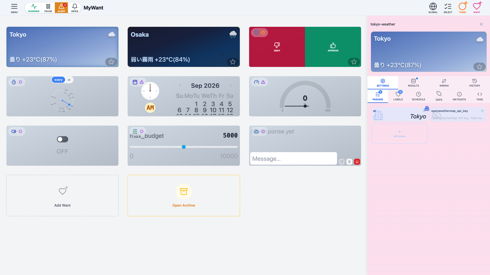
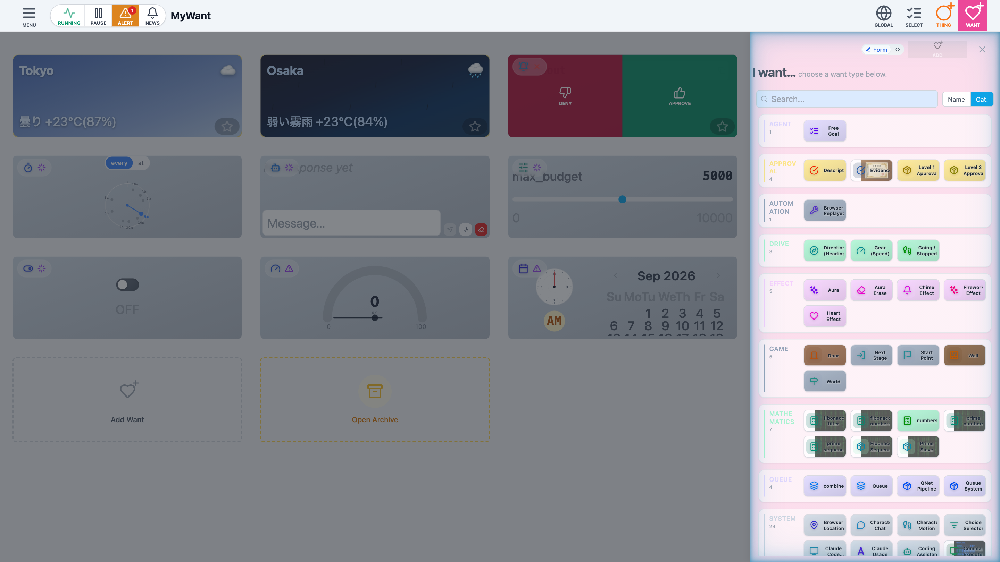
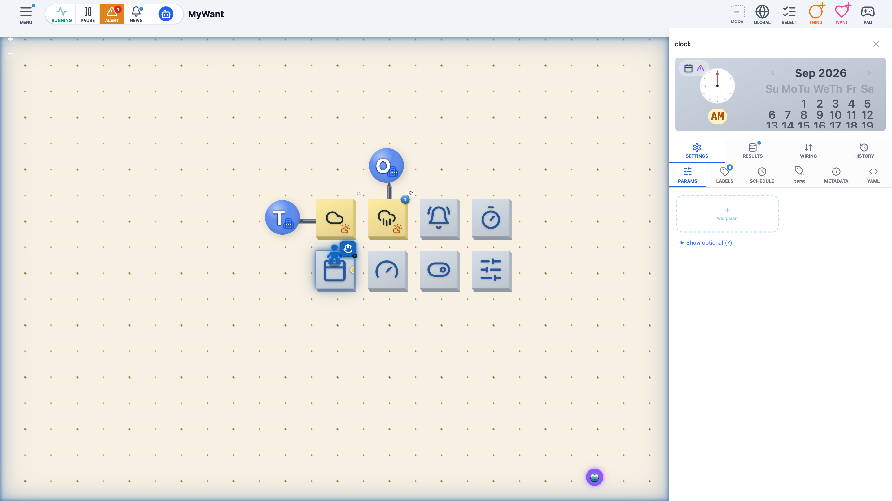

# MyWant



**Declarative chain programming with YAML configuration.** Express what you want to achieve, not how to do it.

📖 **Guides (English / 日本語):** [MyWant guide](https://onelittlenightmusic.github.io/MyWant/) · [mywant-gui guide](https://onelittlenightmusic.github.io/mywant-gui/) · [Developer docs for the GUI](https://onelittlenightmusic.github.io/mywant-gui-dev/)

📚 **Documentation:** [Want System](docs/want-system.md) | [Kata Notation](docs/kata-notation.md) | [Agent System](docs/agent-system.md) | [Agent Catalog](AGENTS.md) | [Examples](docs/agent-examples.md) | [CLI Guide](docs/MYWANT_CLI_USAGE.md) | [Auth / Remote Backends](docs/auth.md)

## Features

- 📝 **YAML-Driven Workflows**: Define complex logic and dependencies through simple declarative YAML.
- 🤖 **Autonomous Agent Ecosystem**: Specialized agents (Do/Monitor/Think) solve your "Wants" based on their "Capabilities".
- 📦 **Modular Recipes**: Package reusable logic into Custom Want Types with flexible parameter support.
- 💻 **Full-Stack CLI (`mywant`)**: Manage the server, Wants, recipes, things, worlds and add-ons from a single tool — locally or on a remote server.
- 📊 **Dashboards**: Watch and steer everything in the browser with [mywant-gui](#the-guis), or on a board with the mywant-guiex canvas.
- 💾 **Persistent Memory**: Continuous state reconciliation and memory recovery across system restarts.

## Quick Start

### 1. Install via Homebrew

`brew trust` is required before installing from a third-party tap that ships binaries.

```bash
# Add the tap and trust it (once — covers every formula in it)
brew tap onelittlenightmusic/mywant
brew trust onelittlenightmusic/mywant

# Install the packages
brew install mywant        # core server + CLI
brew install mywant-gui    # web dashboard
brew install mywant-guiex  # canvas extension for the dashboard (optional)
brew install mywant-rpg    # RPG extension (optional)
```

To upgrade later: `brew upgrade mywant mywant-gui`. If you skip `brew trust`, Homebrew fails with permission errors on the pre-built binaries.

To build from source instead, run `make release` (the CLI lands in `./bin/mywant`).

### 2. Start the System

```bash
mywant start -D        # the MyWant server (localhost:8080)
mywant-gui start -D    # the dashboard
mywant ps              # check status
```

### 3. Open the Dashboard

**[http://localhost:8081](http://localhost:8081)** — every want is a card; press one to see its settings, results, wiring and history.

### 4. Place Your First Want

```bash
# Today's weather in Tokyo — a type and one parameter
mywant wants create -t weather --param at=Tokyo
mywant wants list
```

Or write it in YAML (`coffee.yaml`):

```yaml
wants:
  - metadata:
      name: coffee-break
      type: reminder
    spec:
      params:
        message: "Time for a coffee break! ☕"
        duration_from_now: "15 minutes"
        require_reaction: true
```

```bash
mywant wants create -f coffee.yaml
```

The new want appears on the dashboard right away.

### 5. Explore

```bash
mywant types list              # every kind of want you can place
mywant types get reminder      # its parameters and examples
mywant wants create -t reminder -e   # place a type's own example
```

## The GUIs

### mywant-gui — the dashboard



The open-source web GUI ([onelittlenightmusic/mywant-gui](https://github.com/onelittlenightmusic/mywant-gui)). A header, a grid of cards and a sidebar: every want as a card with its live state, an Add Want form built from each type's parameters, and pages for things, want types, worlds, agents, recipes and logs. Keyboard- and phone-friendly, and scriptable from its CLI (`mywant-gui show want <ID>`, `mywant-gui capture want <ID>`, …). Extensions can add pages, menu entries and designs at runtime.

→ [mywant-gui guide](https://onelittlenightmusic.github.io/mywant-gui/) · [Developer docs](https://onelittlenightmusic.github.io/mywant-gui-dev/)

### mywant-guiex — the canvas



An extension of mywant-gui that lays your wants out as tiles on a board. Things float beside the wants that use them, wires show how wants connect, and a character walks the board — press a tile to open it, or drive the board from `mywant guiex`. Install it with `brew install mywant-guiex`; the dashboard picks it up on its next start.

## API Usage

```bash
# Create a want via the API (a single want, or a list of them)
cat > weather.yaml <<'EOF'
metadata: {name: kyoto-weather, type: weather}
spec: {params: {at: Kyoto}}
EOF
curl -X POST http://localhost:8080/api/v1/wants \
  -H "Content-Type: application/yaml" \
  --data-binary @weather.yaml
# → {"want_ids": ["want-…"], …}

# Its status
curl http://localhost:8080/api/v1/wants/{want_id}/status
```

The full API is described in [docs/backend-api.yaml](docs/backend-api.yaml).

## Writing Want Types and Agents

See the [Want Developer Guide](docs/WantDeveloperGuide.md) for writing want types in Go or YAML, and the [Agent System](docs/agent-system.md) for agents and capabilities.

## Development

```bash
make help      # every target
make check     # fmt, vet and tests
make release   # build ./bin/mywant
make run-mock  # the mock flight server for the travel examples
```

## Requirements

- Go 1.26+ (to build from source)
