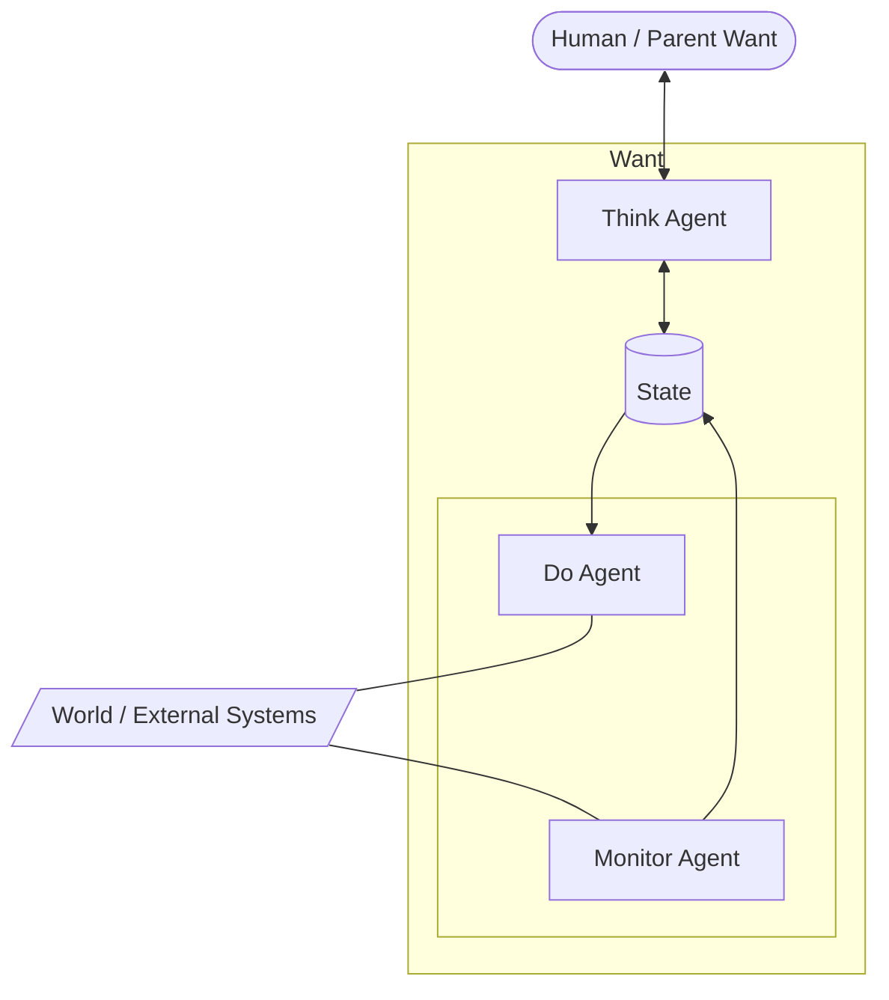

# MyWant Agent System Documentation

## Overview

The MyWant Agent System provides capability-based, autonomous agents that can execute actions and monitor state changes for wants. This system enables wants to delegate specific tasks to specialized agents while maintaining clean separation of concerns.

## Architecture

### Conceptual Overview

The MyWant Agent System operates on a reactive, state-centric architecture where specialized agents collaborate through a central **State**.

#### Agent Control Loop



#### State-Agent Interaction Pattern

```text
       [ Human / Parent Want ]
                 ▲
                 | (read/write parent state)
                 ▼
+----------------|-------------------+
| Want           |                   |
|        [  Think Agent  ]           |
|                ▲                   |
|                | (read/write)      |
|                ▼                   |
|          [   State   ]             |
|             /     \                |
|    (write) /       \ (read)        |
|           /         \              |
| [ Monitor Agent ]  [   Do Agent   ] |
+-------▲------------------|---------+
        |                  |
        | (observe)        | (action)
        |                  ▼
       [      World / External      ]
```

### Core Components

1. **Capabilities** - Define what services are available
2. **Agents** - Implement specific capabilities with two types:
   - **DoAgent** - Performs actions (e.g., make API calls, reserve resources)
   - **MonitorAgent** - Monitors state (e.g., check status, validate conditions)
3. **Agent Registry** - Manages capability-to-agent mapping
4. **Want Integration** - Wants specify requirements and execute matching agents

### Agent Types (Standard Operational Principles)

The MyWant system follows the **Agent-State Interaction Rule (GCP Pattern)** to coordinate agent activities through a structured state flow.

#### ThinkAgent
- **Purpose**: React to state changes and propagate computed values across want boundaries.
- **Operational Principles**:
  - **Goal Setting**: If `goal.*` is missing in the state, initialize it (Trigger: absence of `goal.*`).
  - **Wait for Context**: Wait until `current.*` is populated by Monitor Agents.
  - **Planning**: Compare `goal.*` with `current.*` to generate a `plan.*` (Trigger: presence of both `goal.*` and `current.*`).
- **Examples**: Register in coordinator itinerary, await budget allocation, propagate reservation costs.
- **Execution Characteristic**: **Background Ticker** (default 2s).
- **State Access**: Reads/writes own State and ParentState.

#### MonitorAgent
- **Purpose**: Monitor and validate state by observing the external world.
- **Operational Principles**:
  - **Observation**: Continuously observe external systems or resources.
  - **State Update**: Write the observed external information into `current.*` fields.
- **Examples**: Check reservation status, validate payments, monitor resources.
- **Execution Characteristic**: **Asynchronous**.

#### DoAgent
- **Purpose**: Perform actions that change external state based on generated plans.
- **Operational Principles**:
  - **Execution**: Read the `plan.*` fields and execute the corresponding actions in the external world.
  - **Flexibility**: **DoAgents can be executed even if no `plan.*` is present** (e.g., direct invocation via `ExecuteAgents()`).
  - **Cleanup/Feedback**: Overwrite or remove `plan.*` upon successful execution to prevent redundant actions.
- **Examples**: Make hotel reservations, process payments, send notifications.
- **Execution Characteristic**: **Synchronous**.

#### PollAgent / BackgroundAgent
- **Purpose**: Long-running or system-level background operations.
- **Examples**: Task scheduling, continuous health checks, user reaction polling.
- **Execution Characteristic**: **Persistent**. Registered via `AddBackgroundAgent()`, these agents are initialized when the want starts and remain active throughout the entire lifecycle of the want.
- **Management**: Managed by the want's internal background registry with explicit `Start`/`Stop` signals.

### State-Centric Architecture

All agent types interact with a want's **State** as the central integration point. The diagrams below show each agent type's read/write access pattern and how ThinkAgent uniquely crosses want boundaries via **ParentState**.

#### Agent–State Access Patterns

```
┌──────────────────────────────────────────────────────────────────────┐
│                              Want                                     │
│                                                                       │
│  Triggered via ExecuteAgents()                                       │
│  ┌──────────────────┐  write    ┌──────────────────────────────┐    │
│  │    DoAgent       │──────────►│                              │    │
│  │  (sync, one-shot)│           │           State              │    │
│  └──────────────────┘           │        (key-value store)     │    │
│                                 │                              │    │
│  ┌──────────────────┐  r/w      │                              │    │
│  │  MonitorAgent    │◄─────────►│                              │    │
│  │ (async, contin.) │           │                              │    │
│  └──────────────────┘           └──────────────────────────────┘    │
│                                              ▲                       │
│  Registered via AddBackgroundAgent()         │                       │
│  ┌──────────────────┐  r/w                   │                       │
│  │    PollAgent     │◄──────────────────────►│                       │
│  │ (bg, stop signal)│                        │                       │
│  └──────────────────┘                        │ read / write          │
│                                              │                       │
│  ┌──────────────────┐  r/w                   │                       │
│  │   ThinkAgent     │◄──────────────────────►│                       │
│  │ (bg ticker, 2s)  │                        │                       │
│  └────────┬─────────┘                        │                       │
│           │                                  │                       │
└───────────┼──────────────────────────────────┴───────────────────────┘
            │
            │  GetParentState() / MergeParentState()
            │  (ThinkAgent only)
            ▼
┌──────────────────────────────────────────────────────────────────────┐
│                         Parent Want State                             │
│    e.g. itinerary, target_budgets, costs  (coordinator namespace)    │
└──────────────────────────────────────────────────────────────────────┘
```

#### Agent Access Pattern Summary

| Agent Type | Trigger | Execution | Own State | Parent State |
|:-----------|:--------|:----------|:----------|:-------------|
| DoAgent | `ExecuteAgents()` | Sync, one-shot | write | — |
| MonitorAgent | `ExecuteAgents()` | Async goroutine, continuous | read/write | — |
| PollAgent | `AddBackgroundAgent()` | Persistent bg, stop signal | read/write | — |
| **ThinkAgent** | `AddBackgroundAgent()` | **Persistent bg, ticker (2s)** | **read/write** | **read/write** |

#### Parent–Child State Coordination

When a want has a parent coordinator, ThinkAgents enable state sharing across the want hierarchy. The example below shows how `ConditionThinker` (on each child want) and `BudgetThinker` (on the budget want) collaborate through the coordinator's State:

```
┌───────────────────────────────────────────────────────────────────────┐
│                        Coordinator Want                                │
│                                                                        │
│  ┌─────────────────────────────────────────────────────────────┐      │
│  │                         State                               │      │
│  │  itinerary:      { hotel: {type, name}, flight: {...}, ... }│◄──┐  │
│  │  target_budgets: { hotel: {budget:1666}, flight: {...}, ... }│   │  │
│  │  costs:          { hotel: 450, flight: 800 }                 │   │  │
│  └─────────────────────────────────────────────────────────────┘   │  │
│          ▲ MergeParentState              │ GetParentState           │  │
│          │                              │                  ThinkAgent  │
│          │                     (BudgetThinker)             reads+writes│
└──────────┼──────────────────────────────┼───────────────────────────┘
           │                              │
  ┌────────┼──────────────────────────────┼──────────────────┐
  │        │       Child Want (hotel)     │                  │
  │        │                             ▼                   │
  │  ┌─────────────────────────────────────────────────────┐ │
  │  │                      State                          │ │
  │  │  good_to_reserve: true                              │ │
  │  │  target_budget:   1666.67                           │◄┤ ThinkAgent
  │  │  cost:            450.00                            │ │ (ConditionThinker)
  │  │  _thinker_*:      (internal flags)                  │ │ reads+writes own
  │  └─────────────────────────────────────────────────────┘ │ + parent state
  └──────────────────────────────────────────────────────────┘
```

##### Coordination Sequence (ConditionThinker ↔ BudgetThinker)

```
Child ConditionThinker          Parent BudgetThinker
        │                               │
  [Phase 1: register]                   │
        │                               │
        ├─ MergeParentState ───────────►│  itinerary: {hotel: {type, name}}
        │                               │
        │                         [Phase 1: allocate]
        │                               │
        │                  GetParentState(itinerary)
        │                               │
        │                  MergeParentState ──────────► target_budgets: {hotel: {budget: 1666}}
        │
  [Phase 2: await budget]
        │
        ├── GetParentState(target_budgets) ──────────────────────────────►
        │
        ├─ StoreState ── good_to_reserve = true, target_budget = 1666
        │
  (DoAgent executes reservation)
        │
        ├─ StoreState ── cost = 450
        │
  [Phase 3: propagate cost]
        │
        ├─ MergeParentState ───────────►│  costs: {hotel: 450}
        │                               │
        │                         [Phase 2: aggregate]
        │                               │
        │                  GetParentState(costs)
        │                               │
        │                  StoreState ─────────────────► total_cost = 450
        │                                                remaining_budget = 1216
```

## Configuration

### Capability Definition (`yaml/capabilities/capability-*.yaml`)

```yaml
capabilities:
  - name: hotel_agency
    gives:
      - hotel_reservation
      - hotel_cancellation
    description: "Provides hotel booking and management services"
    version: "1.2.0"
```

### Agent Definition (`yaml/agents/agent-*.yaml`)

```yaml
agents:
  - name: agent_premium
    type: do
    runtime: localGo
    capabilities:
      - hotel_agency
    uses:
      - booking_api
      - payment_gateway
    description: "Premium hotel booking agent"
    priority: 80
    enabled: true
    tags: ["premium", "hotel"]
    version: "2.1.0"

  - name: hotel_monitor
    type: monitor
    runtime: localGo
    capabilities:
      - hotel_agency
    uses:
      - monitoring_api
    description: "Hotel reservation monitoring agent"
    priority: 60
    enabled: true
    tags: ["monitor", "hotel"]
    version: "1.5.0"
```

### Runtime Configuration

The `runtime` field specifies the execution environment for the agent:

- **localGo**: (Default) The agent executes as a registered Go function within the same process.
- **docker**: (Planned) The agent executes inside a dedicated Docker container.

Before an agent starts, the system performs a **Preparation Phase** (`PrepareAgent` status) where it validates the availability of the specified runtime via `bootAgent()`.

### Want Requirements (`yaml/config/config-*.yaml`)

```yaml
wants:
  - metadata:
      name: luxury-hotel-booking
      type: hotel
    spec:
      params:
        hotel_type: luxury
        check_in: "2025-09-20"
        check_out: "2025-09-22"
      requires:
        - hotel_reservation  # This triggers agent selection
```

## Agent Implementation

### Agent Interface

```go
type Agent interface {
    Exec(ctx context.Context, want *Want) error
    GetCapabilities() []string
    GetName() string
    GetType() AgentType
    GetUses() []string
}
```

### DoAgent Implementation

```go
func (r *AgentRegistry) hotelReservationAction(ctx context.Context, want *Want) error {
    fmt.Printf("Hotel reservation agent executing for want: %s\n", want.Metadata.Name)

    // Stage all state changes as a single object
    want.StageStateChange(map[string]interface{}{
        "reservation_id": "HTL-12345",
        "status":        "confirmed",
        "hotel_name":    "Premium Hotel",
        "check_in":      "2025-09-20",
        "check_out":     "2025-09-22",
    })

    // Commit all changes at once
    want.CommitStateChanges()

    return nil
}
```

### MonitorAgent Implementation

```go
func (r *AgentRegistry) hotelReservationMonitor(ctx context.Context, want *Want) error {
    fmt.Printf("Hotel reservation monitor checking status for want: %s\n", want.Metadata.Name)

    if reservationID, exists := want.GetState("reservation_id"); exists {
        // Check external system status
        status := checkReservationStatus(reservationID)

        // Stage monitoring updates
        want.StageStateChange(map[string]interface{}{
            "reservation_id": reservationID,
            "status":        status,
            "last_checked":  time.Now().Format(time.RFC3339),
            "room_ready":    true,
        })

        // Commit all updates
        want.CommitStateChanges()
    }

    return nil
}
```

## Execution Flow

### 1. Want Execution
```go
func (hw *HotelWant) Exec(using []chain.Chan, outputs []chain.Chan) bool {
    // Begin exec cycle
    hw.Want.BeginProgressCycle()
    defer hw.Want.EndProgressCycle()

    // Execute agents based on requirements
    if err := hw.Want.ExecuteAgents(); err != nil {
        // Handle error
        return false
    }

    return true
}
```

### 2. Agent Discovery and Execution
```go
// ExecuteAgents finds matching agents and runs them in goroutines
func (n *Want) ExecuteAgents() error {
    for _, requirement := range n.Spec.Requires {
        agents := n.agentRegistry.FindAgentsByGives(requirement)
        for _, agent := range agents {
            // Execute in goroutine with context cancellation
            go n.executeAgent(agent)
        }
    }
    return nil
}
```

### 3. State Management
Agents use batched state updates for efficiency:

```go
// Single key-value staging
want.StageStateChange("key", "value")

// Object-based staging (preferred)
want.StageStateChange(map[string]interface{}{
    "key1": "value1",
    "key2": "value2",
    "key3": "value3",
})

// Atomic commit
want.CommitStateChanges()
```

## Lifecycle Management

### Agent Lifecycle

1. **Discovery**: A want specifies requirements, and the `AgentRegistry` finds matching agents based on capabilities.
2. **Preparation (`PrepareAgent`)**: The want transitions to the `prepare_agent` status. The `bootAgent()` function checks if the required runtime (localGo or Docker) is ready.
3. **Execution**: Agents are dispatched based on their type:
   - **DoAgents** are executed synchronously.
   - **MonitorAgents** are launched in background goroutines.
4. **State Updates**: Agents perform tasks and stage state changes, which are committed atomically to the want's state.
5. **Cleanup**: When a want is achieved or fails, it automatically stops all associated agents and background tasks.

### Execution Patterns

| Pattern | Trigger Method | Agent Types | Characteristics |
| :--- | :--- | :--- | :--- |
| **Dynamic Task** | `ExecuteAgents()` | `DoAgent`, `MonitorAgent` | Triggered by want logic when specific capabilities are needed. |
| **Persistent Task** | `AddBackgroundAgent()` | `BackgroundAgent`, `PollAgent` | Constant monitoring or system services that live as long as the want. |
| **State-Reactive** | `AddBackgroundAgent()` | `ThinkAgent` | Ticker-based background loop that reads/writes own State and ParentState for cross-want coordination. |

### Status Transitions

During agent execution, a want follows this status flow:
`Reaching` → **`PrepareAgent`** (booting) → `Executing` (sync/async) → `Reaching` (after boot/sync completion) → `Achieved/Failed` (terminal)

### Goroutine Management

```go
// Step 1: Preparation
n.SetStatus(WantStatusPrepareAgent)
err := n.bootAgent(ctx, agent)

// Step 2: Dispatch
if agent.GetType() == DoAgentType {
    // Synchronous execution
    err = executor.Execute(ctx, agent, n)
} else {
    // Asynchronous execution
    go executor.Execute(ctx, agent, n)
}
```

## Validation

The system uses OpenAPI 3.0.3 specifications for validation:

- **`spec/agent-spec.yaml`** - Defines agent and capability schemas
- **Validation**: All YAML files validated at load time
- **Error Handling**: Detailed error messages for invalid configurations

### Validation Example Output

```
✅ [VALIDATION] Capability validated successfully against OpenAPI spec
✅ [VALIDATION] Agent validated successfully against OpenAPI spec
❌ agent structure validation failed: agent at index 0 missing required 'type' field
```

## Integration with Want Types

### Hotel Want Example

```go
type HotelWant struct {
    Want *Want
}

func RegisterHotelWantTypes(builder *ChainBuilder, agentRegistry *AgentRegistry) {
    builder.RegisterWantType("hotel", func(metadata Metadata, spec WantSpec) interface{} {
        want := &Want{
            Metadata: metadata,
            Spec:     spec,
            State:    make(map[string]interface{}),
        }
        if agentRegistry != nil {
            want.SetAgentRegistry(agentRegistry)
        }
        return &HotelWant{Want: want}
    })
}
```

## Demo Usage

### Running the Hotel Agent Demo

```bash
make run-hotel-agent
```

### Expected Output

```
🏨 Starting Hotel Agent Demo
[VALIDATION] Capability validated successfully against OpenAPI spec
[VALIDATION] Agent validated successfully against OpenAPI spec
🔧 Loaded Capabilities:
  Want 'luxury-hotel-booking' requires: [hotel_reservation]
    Agents for 'hotel_reservation': agent_premium(do) hotel_monitor(monitor)
🚀 Executing chain...
Hotel reservation agent executing for want: luxury-hotel-booking
💾 Committed 5 state changes for want luxury-hotel-booking in single batch
Hotel reservation monitor checking status for want: luxury-hotel-booking
💾 Committed 4 state changes for want luxury-hotel-booking in single batch
✅ Hotel Agent Demo completed
```

## Best Practices

### 1. Agent Design
- Keep agents focused on single responsibilities
- Use DoAgents for actions, MonitorAgents for status checking
- Implement proper error handling and timeouts

### 2. State Management
- Use object-based staging for multiple related updates
- Commit changes atomically to maintain consistency
- Include timestamps and metadata in state updates

### 3. Configuration
- Use descriptive names for capabilities and agents
- Include version information for tracking
- Add tags for easy filtering and organization

### 4. Error Handling
- Validate configurations early with OpenAPI schemas
- Implement graceful degradation for agent failures
- Log detailed information for debugging

### 5. State Ownership Rule (CRITICAL)

> **Each want is the sole owner of its own State and Status.**
> No Agent — and no code running on behalf of Want A — may read into another
> Want B and directly mutate B's state or status.

#### Why this rule exists

Every want runs in its own goroutine. Writing to a foreign want's `State` or calling a foreign want's `SetStatus()` from outside that goroutine bypasses all locking assumptions and causes data races, broken status transitions, and corrupted history.

#### The rule, concretely

| Context | Allowed | Forbidden |
|:--------|:--------|:----------|
| `Progress()` / `Initialize()` | `b.StoreState(...)`, `b.SetStatus(...)` on receiver | `otherWant.StoreState(...)`, `otherWant.SetStatus(...)` |
| Agent `Exec(ctx, want)` | `want.StoreStateForAgent(...)` on the passed-in `want` | fetching a different want from `cb.GetWants()` and writing its state |
| ThinkAgent `ThinkFunc` | `want.StoreState(...)` on own want, `want.MergeParentState(...)` | writing state on any sibling or child want directly |

#### Correct pattern for cross-want coordination (cancel + rebook)

When one want needs to trigger a status change in another, use an **indirect signal**:

```
Itinerary (want A)                     reserve_hotel (want B)
      │                                       │
      │  w.StoreState("_cancel_requested",    │
      │               true)                   │
      │  cb.RestartWant(wantB.ID)  ──────────►│  goroutine restarts
      │                                       │
      │                                       │  Initialize(): detects _cancel_requested
      │                                       │  Progress():   calls b.SetStatus(WantStatusCancelled)
      │                                       │               ← owns its own status ✅
      │◄── status == WantStatusCancelled ─────┘
      │
      │  (now safe to dispatch replacement want)
```

**Never do this:**

```go
// ❌ ILLEGAL — writing a foreign want's state from outside its goroutine
for _, w := range cb.GetWants() {
    if w.Metadata.ID == targetID {
        w.SetStatus(WantStatusCancelled)   // race condition, ownership violation
        w.StoreState("cancelled", true)    // same violation
    }
}
```

**Always do this instead:**

```go
// signal the target; let it cancel itself
for _, w := range cb.GetWants() {
    if w.Metadata.ID == targetID {
        w.StoreState("_cancel_requested", true)  // only a flag write — safe
        break
    }
}
cb.RestartWant(targetID)  // wake the target's goroutine to process the flag
```

+### 6. Hierarchy Rule for Want Dispatch
+
+> **Sub-wants are forbidden from creating other sub-wants directly.**
+> A want should never call `cb.AddWant` or similar methods to spawn siblings or children.
+
+#### Correct implementation for dynamic dispatch (e.g. Itinerary)
+
+1. **The Sub-want (Itinerary)** writes a dispatch request to the **Parent (Target)** state using `StoreParentState("_dispatch_queue", requests)`.
+2. **The Parent (Target)** has a `DispatchThinkerAgent` running.
+3. **DispatchThinkerAgent** monitors the queue and calls `parent.AddChildWant(newWant)` to perform the actual dispatch.
+
+This ensures that the responsibility for execution graph expansion always resides with the upper hierarchy (Target/Recipe).
+
 ## Troubleshooting

 ### Common Issues


1. **Agent Not Found**
   - Check that capability `gives` matches want `requires`
   - Verify agent has the required capability

2. **Validation Failures**
   - Ensure YAML follows OpenAPI schema
   - Check required fields are present
   - Validate agent types are `do`, `monitor`, or `think`

3. **State Not Updated**
   - Confirm agent calls `CommitStateChanges()`
   - Check for goroutine panics in logs
   - Verify agent execution completes successfully

### Debug Tips

- Use validation output to identify configuration issues
- Check agent execution logs for runtime errors
- Monitor state history for unexpected changes
- Verify capability-to-agent mappings are correct

---

## Implementation Plan for GCP Pattern

To fully adopt the Agent-State Interaction Rule, the following phases are planned:

### Phase 1: Foundation (Core Helpers)
- Add dedicated helper methods to the `Want` struct in `engine/core/want.go`:
  - `SetGoal(key, val)`, `GetCurrent(key)`, `SetPlan(key, val)`, `ClearPlan(key)`
- These helpers will automatically handle the `goal.`, `current.`, and `plan.` prefixes.

### Phase 2: Migration (Agent Refactoring)
- Update `ThinkAgent` implementations (e.g., `condition_thinker`) to use GCP prefixes for goal and plan management.
- Update `MonitorAgent` implementations (e.g., `monitor_flight_api`) to write results to `current.*`.
- Update `DoAgent` logic to check for `plan.*` before execution, while maintaining backward compatibility for direct calls.

### Phase 3: Visibility & Validation
- Update the Dashboard (UI) to group state fields by GCP categories for better observability.
- Add E2E tests specifically verifying the GCP loop (Think -> Plan -> Do -> Monitor -> Current -> Think).