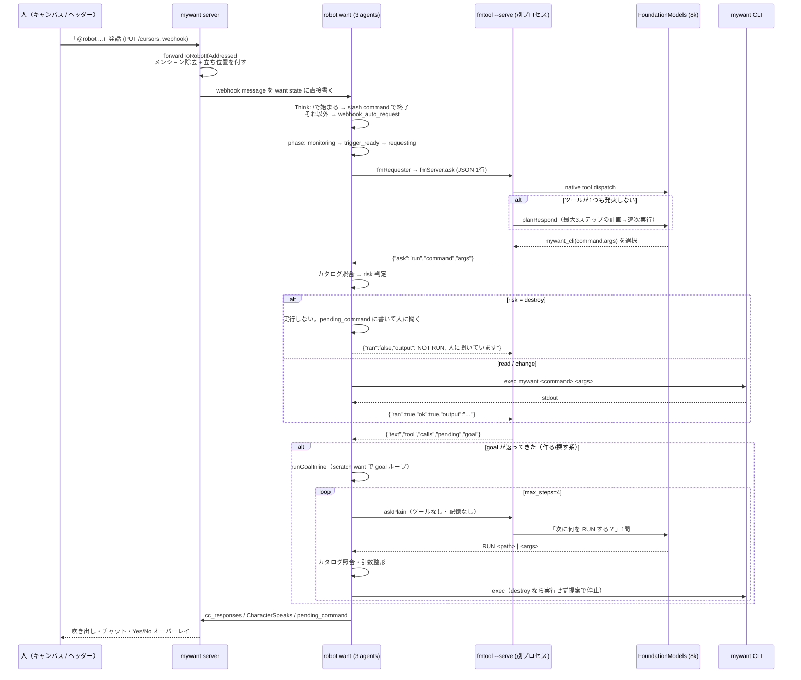
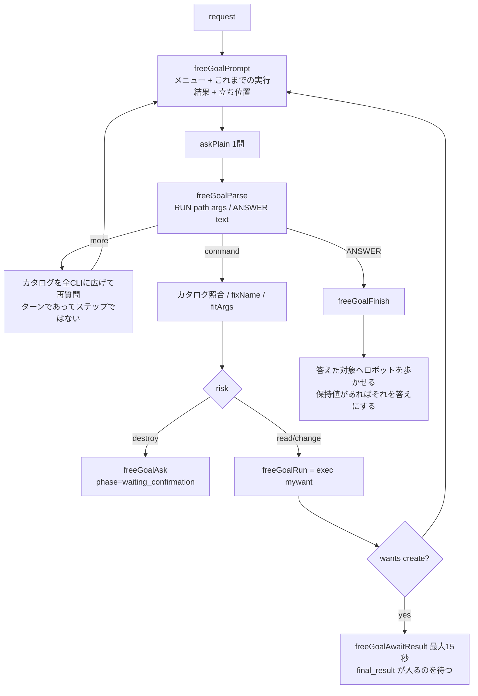

# ロボットへのリクエストの分解

「@robot Nakanoの天気は？」と言ってから答えが返るまでに、リクエストは **2つのリポジトリ・
6つの段**を通ります。このドキュメントはその分解を、どこで何が決まるかという観点で整理します。

- **fm-tools-proto** (`~/work/fm-tools-proto`, Swift/macOS) — 端末内モデル `fmtool`。
  Apple FoundationModels の 8k モデルに**言語の仕事だけ**をさせる薄い殻。
- **mywant** (このリポジトリ, Go) — 入口・want のライフサイクル・コマンドカタログ・実行・
  安全境界・結果の記録。`fmtool/` にプロトタイプの**ベンダーコピー**を抱える（後述の「ズレ」参照）。

## 責務の分け方

一行で言うと、**「言葉は fmtool、判断と実行は mywant」**です。
初期はモデル側に全部やらせていて、失敗の仕方が記録されています
(`engine/types/agent_free_goal.go` 冒頭: 1つの want を消すのに `gui tile set` を48回呼んだ)。

| 決めること | 決める場所 |
|---|---|
| 日本語/英語の理解・返答の文面 | fmtool（モデル） |
| どのコマンドをどの引数で呼ぶか | fmtool（モデル） |
| どの CLI コマンドが存在するか | mywant CLI `mywant commands --json` |
| そのコマンドが read / change / destroy か | mywant CLI（`commandRisk`） |
| 盤面のコマンドかどうか | mywant CLI（`commandCanvas`） |
| **コマンドを実際に走らせるか** | **mywant（`fmBrokerRun`）** — fmtool は1つも実行しない |
| 何ステップで打ち切るか | mywant（`max_steps`、同一コマンド反復検出） |
| 「はい」が本人の発話かどうか | mywant（`isOnlyConsent`）— 1箇所のみ |
| 答えをどこに書くか（吹き出し・履歴・カード） | mywant |

## 全体シーケンス



## 段ごとの分解

### 0. 入口 — 「誰に言ったか」を決める

発話はまず**部屋への発話**として記録され、`@robot` が付いているものだけがエージェントに渡ります
(`engine/server/speech_log.go:184` `forwardToRobotIfAddressed`)。

- 経路は3つ: キャンバスの発話 (`handlers_cursors.go:579`)、
  ヘッダー/チャットの webhook (`handlers_webhook.go:60-76`)、
  そして会話を介さない `mywant do`（後述）。
- メンションは**経路情報であって依頼内容ではない**ので剥がされる。
- 人の立ち位置が `contextForSpeaker` で本文の後ろに1行追加される。「これ消して」「ここに置いて」
  は半分ジェスチャーなので、座標を落とすと意味が消えるため。
- ロボット自身の発話は転送されない（自分の返答で自分を起動しない）。

渡し方は HTTP ではなく want の state への直接書き込み（`storeWebhookMessage`）。

### 1. robot want — いつ送るかを決める

`robot` want は coding want と同じ3エージェント構成で、`provider` パラメータで答え手を選びます
(`claude_code` / `gemini` / `fm`)。`fm` が端末内モデル、macOS 以外では自動的に claude_code に落ちます
(`engine/types/agent_claude_code.go:285-296`)。

- **Think** (`agent_claude_code.go:144`): 新着メッセージを見て
  - `/` で始まれば `tryRunSlashCommand` が `mywant <tokens>` として直接実行し、**モデルには届かない**
    (`engine/types/robot_slash_command.go:23`)。
  - それ以外は `webhook_auto_request` に置き、`next_action=send_request` を Plan に書く。
  - 同じリクエストID が送信済みなら捨てる（冪等ログ）。
- **Progress の phase 機械** (`engine/types/claude_code_types.go:100`):
  `monitoring → trigger_ready → requesting → awaiting_response → response_received → monitoring`。
- **Do** (`fmRequester`, `engine/types/agent_fm.go:131`): 実際に端末内モデルへ。
- **Monitor** (`fmSessionMonitor`): fm にはセッションファイルがないので、
  すでに手元にある答えを「新着」として報告するだけ。これがないと want が
  `awaiting_response` に居座って次の質問を聞かなくなる。

### 2. fmServer — 1本の会話を保つ

`fmtool` をコマンドとして毎回起動すると「新宿はどこ？」「その隣は？」が繋がりません。そこで
`fmtool --serve` を常駐させ、**stdin/stdout の JSON Lines** で1問1答します
(`engine/types/fm_server.go`)。

| 仕組み | 内容 |
|---|---|
| 排他 | `ask` がロックを取る。1セッション＝1本の会話なので同時実行しない |
| バイナリ差し替え検知 | `binaryStamp`（mtime+size）が変わっていたら旧プロセスを捨てて起動し直す |
| 再起動 | 2回まで試行。プロセスが死んでいても質問者にはエラーにしない |
| タイムアウト | 既定120秒。超えたらプロセスごと kill（途中応答と噛み合わないため） |
| 実況 | fmtool の **stderr** を1行ずつ読み、`[mywant ...]` / `[tool: ...]` を `RecordCCActivity` に流す。「考えています」しか出ないのを避けるため |

ストリームに流れる行は3種類あります。mywant → fmtool が質問、fmtool → mywant が
**許可の要求**と**答え**です。`readReply` は答えが来るまでの間、要求を捌き続けます。

```
mywant → fmtool  {"id":1,"prompt":"荻窪はどこ？"}
fmtool → mywant  {"ask":"run","seq":1,"command":"point","args":["荻窪"]}
mywant → fmtool  {"seq":1,"ran":true,"ok":true,"output":"The robot is standing on 荻窪 …"}
fmtool → mywant  {"id":1,"text":"荻窪はここです (6, 0).","tool":"mywant_cli","calls":1}
```

コマンドが **picture want を読んだ**とき（risk=read のコマンドの引数が picture want を名指ししていたとき）は、
実行結果に写真のファイルと、picture want が取り込み時に OCR で読んだ文字の行を添えます:

```
mywant → fmtool  {"seq":1,"ran":true,"ok":true,"output":"…","picture":{"image":"/tmp/mywant-picture-…","lines":["SCORE CARD | …","PAR | 5 | 3 | …"]}}
```

fmtool はターンの答えが出たあと、**別の使い捨てセッション**で写真と文字の両方を見せて質問をもう一度聞き、
答えを **OCR で読めた文字列のどれか1つ**に縛ります（`Picture.swift`）。モデルは「どれか」を選ぶだけで
文字を書かないので、写真の文字を読み違えることも作ることもありません。文字だけ渡すとパーを合計と取り違え、
写真だけ渡すと日付やパーを読み違えたため、この組み合わせにしています。会話のセッションを使わないのは、
8k の枠に写真を入れると以降の会話が押し出されるためです。
その答えは picture want の `answers` に残り、チャットの返答には `picture_id` / `answer_id` が付いて
「いいね / 違う」の評価も同じ `answers` に記録されます（`recordFMAnswerAbout`、`ChatThread.tsx`）。

コマンドを走らせている間は**タイムアウトの時計を止めます**（`readReply` が自分の所要時間を
deadline に足し直す）。タイムアウトが見張っているのは「エージェントが黙ったこと」であって、
こちらが代わりに働いている時間ではないからです。

質問 JSON は2種類:

| | `ask`（通常） | `askPlain` |
|---|---|---|
| 送る値 | `{"id","prompt"}` | `{"id","prompt","plain":true}` |
| ツール | あり | **なし** |
| 会話の記憶 | あり（常駐セッション） | なし（毎回使い捨てセッション） |
| 用途 | ロボットとの会話 | mywant 側の goal ループが「言語だけ」借りる |

`plain` が要るのは、計画用の質問を通常セッションに投げたらモデルが自分のツールで検索を始め、
「検索結果に必要な情報がありません」と答えて何も計画しなかったから (`Serve.swift:112-122`)。

### 3. fmtool 内部 — 3段のフォールバック

`run()` (`main.swift:135`) は**native → plan → rescue** の順に落ちます。

1. **native**: FoundationModels 自身のツールディスパッチ。1つでも発火すればその答えを返す。
2. **plan** (`Plan.swift:36`): 何も発火しなかったとき、**最大3ステップ**の計画
   （どのツールを・何のために）を Guided Generation で出させ、1ステップずつ実行。
   各ステップには前ステップの出力が渡る。「どこにある？」は
   「名前を調べる→指さす」の2手が要るため。手順をツール説明に書き込む方式はスケールしないので捨てた。
3. **rescue** (`Rescue.swift`): 計画が使い物にならなくても、1ツールだけ選んで実行する床。

常駐モード (`servedRespond`) では native → plan の2段で、**コンテキスト溢れは trim して1回だけ再試行**します。

### 4. fmtool のツール群 — スキーマは CLI が書く

ツールは時計・電卓・ファイル・ホスト情報と、MyWant 用の3つです。重要なのは
**MyWant のコマンド一覧を Swift 側に持たない**こと (`MyWantCLI.swift` 冒頭)。
起動時に `mywant commands --json` を1回叩き、その答えがそのままツールのスキーマ (`anyOf`) になります。

| ツール | 中身 |
|---|---|
| `mywant_cli` | risk=read の全部 ＋ **canvas=true なら change も destroy も**（+ `do`） |
| `mywant_start` / `mywant_deploy` | サーバ起動・レシピデプロイ |

**削除用の別ツールはもうありません。** かつては `mywant_delete` が
「モデルが `confirmed=true` と言い、かつ人の直前発話が yes」という二重ゲートを持っていましたが、
1段目はモデルの自己採点なので2段目が必要になる、という構造でした。いまは実行者が mywant なので
モデルに同意を聞くこと自体をやめ、ツールは1つです。

盤面かどうかの判断も CLI の `canvas` ラベルをそのまま使います（Swift 側の `boardGroups` は削除）。
`do` だけ canvas=false なので明示的に足しています — `do` は盤面を作る唯一の入口だからです。
`gui start|stop` や `config`・`custom` は canvas=false なので自動的に外れます。

オファーから外すもの: `commands` 自身、`... where`（`point` が上位互換）。

`call()` (`MyWantCLI.swift:284`) がやる整形:

- カタログにないコマンドは**走らせない**（モデルはもっともらしい偽コマンドを作る）。
- 引数は原則1語として渡す。usage 行のプレースホルダが2個以上、またはフラグを含むときだけ分割。
  （「transit search」という1語の名前を2語に割って CLI に蹴られた事例）
- 失敗時は usage を読んで **「このコマンドは X を取るのに Y をもらった」** という形に書き換える。
  「failed」とだけ返したら別のコマンドを3連続で試した。
- 出力は4000字で切る（モデルの世界は8kトークン）。

### 5. `do` のハンドバック — ここが分解の要

**「作りたい」「探して」系は fmtool では実行しません。** `command == "do"` が選ばれると、
fmtool は `GoalBox` に**人の発話そのまま**を書いてターンを終え、返信 JSON に `goal` フィールドを載せます
(`MyWantCLI.swift:302-308`)。

理由は2つ、どちらも実測された失敗です (`Handback.swift`, mywant commit `b8239e41`)。

- 以前は `mywant do` を shell out していた → **質問するたびに free_goal の want が盤面に残った**。
- しかもそれは同じ8kモデルとの**2本目の会話を1本目の内部から始める**ことで、互いに待ち合った。

mywant 側 (`agent_fm.go:260-276`) は `reply.Goal` を受け取ると `runGoalInline` を回します。

- **scratch want**（盤面に追加されない Want 構造体）を作って `executeFreeGoal` に渡す
  (`engine/types/agent_free_goal.go:118`)。
- 走ったコマンドは400ms ごとに state から読み出して `RecordCCActivity` に流すので、
  want がないのに「考えている過程」は見える。
- `mywant do` は今まで通り**本物の want を作る**。端末から頼むときは want だけが記録だから。

### 6. goal ループ — 1問ずつ、答えは必ず照合する

`executeFreeGoal` (`agent_free_goal.go:174`) は「計画を立てさせない」ループです。
計画を立てさせると自信満々に間違え、その間違った計画に従い続けた、という測定結果に基づく設計。



ループが守る規則（すべて失敗から来ています）:

| 規則 | 理由 |
|---|---|
| カタログにないコマンドは走らせない | モデルは存在しないコマンドを作る |
| 最初のターンは必ずコマンド。答えてはいけない | 盤面を見ずに「荻窪は北辰座です」と作り話をした |
| destroy はループでは絶対に走らせない | 文章に書き起こして人に聞く（`pending_command`） |
| 同じコマンド＋同じ引数の反復で打ち切り | 詰まったモデルは同じことを永遠に言う |
| `max_steps`（既定4）で打ち切り | 〃 |
| 空応答は2回まで再質問、3回目で提案に切り替え | 読めない返事で依頼を終わらせない |
| `--type` は別の1問にする | 想像で `--type aura` と書き、実在する別の型の want ができた |
| パラメータも別の1問にする | `at` のない weather want はどこでもない場所を読む |
| 提案は盤面に実在する名前でなければ却下 | `wants get [name-or-id]` という「はい」と言えない提案が出た |

メニュー（`freeGoalMenu`）は **observe / control の2つ見出し**に分かれ、まず**canvas=true のコマンドだけ**を
見せます。全 read コマンドを入れたら achievements・agents・config が先頭に並び、盤面のコマンドが埋もれたため。
モデルが `more` と言ったときだけ全CLIに広げます。

### 7. 「はい」は1箇所でだけ読まれる

`answerGoalPending` (`agent_fm.go`) だけです。**モデルには同意を聞きません。**

待ち状態を書くのは2つ — goal ループの提案 (`freeGoalAsk`) と、エージェントが
destroy に手を伸ばしたとき (`fmBrokerRun`) — ですが、どちらも同じ文を同じキーに書くので、
読む側は区別しません。

```
待ちを書く ──┬─ freeGoalAsk      （goal が「まだありません。作れます」）
             └─ fmBrokerRun      （エージェントが削除を選んだ）
                     ↓  goal_pending / pending_command に同じ1文
人が答える ──┬─ チャットに「はい」
             └─ Yes/No オーバーレイ（本人として「@robot はい」と発話する）
                     ↓
          answerGoalPending  ← ここだけ。モデルは通らない
```

以前は fmtool 側にも `ConsentGate` があり、同意語のリストが2つ存在しました。すでに食い違っていて、
Swift 側は自分のコメントが挙げる反例「はい、でも先に天気を見せて」を同意として通していました
（13文字なので24字ガードを抜ける）。いまのルールは長さではなく**分解**です:

- 句読点で切り、残った断片が**すべて** yes であること (`isOnlyConsent`)
- 断片は yes 語そのもの、丁寧語の尻尾付き（「はいです」）、yes の連結（「はいお願いします」）のいずれか
- 1つでも別の内容が混じれば同意ではない。待ちは失効し、その発話は新しい依頼としてモデルへ行く

「いいえ」系は先に読まれ、待ちを捨てて何も実行しません。

`pending_command` と `goal_pending` の2キーは今も別物です。前者は**画面に出ている質問**で、
答えた瞬間にクライアントが消してよいもの（`mywant do` の goal want も同じキーで表示される）。
後者は**yes が実行する文**で、この want だけのもの。表示を楽観的に消しても、答えが
実行対象を見失わないようにするためです。

### 8. 答えの着地

`recordFMAnswer` (`agent_fm.go:300`) が、どのプロバイダでも同じ場所に書きます。

- `cc_responses`（直近20件のリングバッファ）＝チャット履歴
- `CharacterSpeaks("robot", ...)` ＝盤面の吹き出し（口を持つのは robot want だけ）
- `pending_command` ＝オーバーレイが読む待機中コマンド
- 失敗しても**必ず何か言う**。「答えられませんでした: 理由」。黙るのは聞こえていないのと区別がつかないため。

## 8kトークンとの戦い（各段の対策）

| 段 | 対策 |
|---|---|
| fmtool セッション | 6ターンごと、かつ溢れたときに transcript を trim。直近6エントリを**プロンプト境界から**繰り越す（途中で切ると "Unable to tokenize prompt"） |
| ツールスキーマ | コマンド説明は載せず path のみ。要約は先頭24件 |
| `mywant_cli` 出力 | 4000字で切る（mywant 側も `freeGoalOutputLimit` で1200字）|
| goal ループ出力 | 1200字で保持、プロンプトには400字 |
| goal プロンプト内の出力 | `freeGoalRelevantOutput` — 依頼が名指しした名前を含む行を**先頭に**並べる（`board` の40行のうち先頭2行しか見えず、見えていた別の駅を答えた事例） |
| 計画 | 最大3ステップ |

## リポジトリ境界と、同期のしかた

`mywant/fmtool/` は fm-tools-proto を `git subtree` で取り込んだコピーです。**歩調が合っていないと
静かに壊れる**関係にあります。いまは両方向に壊れます:

- 古い fmtool + 新しい mywant → エージェントが自分でコマンドを実行してしまう（門番を通らない）
- 新しい fmtool + 古い mywant → `ask` に誰も答えず、ターンがタイムアウトまで固まる

どちらもエラーメッセージは出ません。**必ず対で更新すること。**

実際に一度開きました。取り込みが `a88e408` で止まっている間に proto が3コミット進み、
`make fmtool` が作るバイナリは `goal` も `pending` も送らない状態でした。

| proto commit | 内容 | mywant 側の依存 |
|---|---|---|
| `86e06a3` | 返信に `pending`（待機中コマンド）を載せる | `fmReply.Pending` (`fm_server.go:94`) |
| `39cdf69` | 削除対象名を盤面と照合・修正 | — |
| `ea4f220` / `a4e7837` | `do` のハンドバック（`GoalBox`、返信の `goal`）と `boardGroups` への `"do"` 追加 | `reply.Goal` → `runGoalInline` (`agent_fm.go:260`) |

`7e2d7a4` まで取り込んで解消済みです。次に proto が進んだら:

```sh
git remote add fm-tools-proto https://github.com/onelittlenightmusic/fm-tools-proto.git  # 初回のみ
git subtree pull --prefix=fmtool fm-tools-proto main
make fmtool          # bin/fmtool を作り直す
make install-fmtool  # インストール環境で動かすなら
```

取り込み直したら**バイナリも作り直すこと**。常駐プロセスの方は `binaryStamp`（mtime+size）を
毎回見ているので、置き換えれば自分で起動し直します (`fm_server.go`)。

### どのバイナリが選ばれるか

3つの探索がありますが、**一緒にビルドしたものが一緒に使われる**ように並べてあります。

| 誰が探すか | 順序 |
|---|---|
| サーバ → mywant CLI (`mywantBinaryPath`) | `MYWANT_BIN` → **実行中の自分** → PATH → `~/.local/bin` |
| サーバ → fmtool (`fmToolPath`) | `MYWANT_FM_BIN` → **実行中バイナリの隣** → PATH → `~/.local/bin` |
| fmtool → mywant CLI (`MyWantCLI.binaryPath`) | `MYWANT_BIN`（**サーバが渡す**） → Homebrew → `~/.local/bin` |

サーバと CLI は**同じバイナリ**（`mywant start` は他のコマンドと同じツリーのサブコマンド）なので、
実行中の自分を使えばバージョン差は原理的に生じません。以前は PATH が先で、実際に開きました:
サーバが `bin/` の v0.7.0、走るコマンドは `~/.local/bin` の v0.6.0 で、**ロボットが選ぶコマンド一覧も
そちらから読まれていました**。その日は偶然一致していただけです。

fmtool には自分から mywant を導く手がかりがないので、サーバが起動時に `MYWANT_BIN` を
環境変数で渡します (`fm_server.go` の `start`)。これでツール schema を作るカタログと、
実際にコマンドを走らせるバイナリが必ず同じものになります。

> `agent_fm.go:47-51` のコメントはこの構造自体をこう書いています ——「実験の間は別リポジトリでよかったが、
> want type が依存するならもう実験ではない。歩調を合わせなければならない2つのリポジトリは、
> 穴の空いた1つのリポジトリだ」。上のズレはその穴が実際に開いた例です。

## ファイル早見表

| 段 | ファイル |
|---|---|
| 入口・メンション | `engine/server/speech_log.go`, `handlers_cursors.go`, `handlers_webhook.go` |
| robot want / phase | `engine/types/robot_types.go`, `claude_code_types.go`, `engine/bundled/want_types/system/robot.yaml` |
| slash command 分岐 | `engine/types/robot_slash_command.go` |
| プロバイダ選択 | `engine/types/agent_claude_code.go` |
| 端末内モデル呼び出し・同意 | `engine/types/agent_fm.go` |
| 写真について答える | `engine/types/picture_types.go`（OCR・`answers`）↔ `fmtool/Sources/fmtool/{OCR,Picture}.swift` |
| 実行の門番 | `engine/types/fm_broker.go` ↔ `fmtool/Sources/fmtool/Broker.swift` |
| 常駐プロセス管理 | `engine/types/fm_server.go` |
| goal ループ | `engine/types/agent_free_goal.go`, `free_goal_types.go` |
| コマンドカタログ（risk/kind/canvas） | `client/cmd/mywant/commands/commands.go` |
| `mywant do` | `client/cmd/mywant/commands/do.go` |
| fmtool 本体 | `fmtool/Sources/fmtool/{main,Serve,Plan,Rescue,MyWantCLI,Broker,Handback,Tools}.swift`（上流: `fm-tools-proto/swift/`） |
| Yes/No UI | `mywant-gui/web/src/components/dashboard/PendingConfirmOverlay.tsx` |
